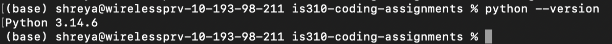
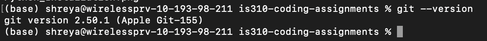
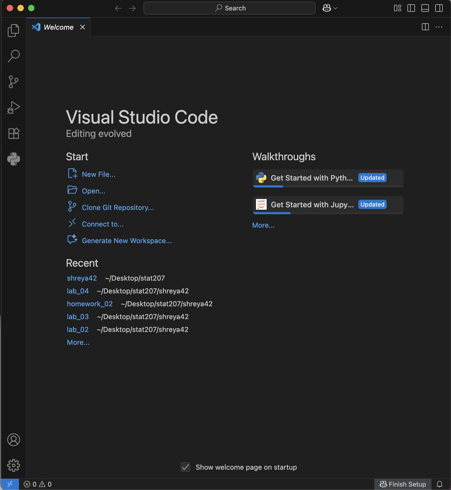

# IS 310 Coding Assignments

This repository has all my coding assignments for IS 310.

# Init IS310 Homework
# Proof of Installation:
1. Python

2. Git

3. VS Code

4. Hypothesis Username

My Hypothesis username is: shreya42

5. AI Tool/Workflow

I will most likely be using ChatGPT during the semester to help me solve problems related to coding errors and to help me understand some of the concepts that I don't fully understand. 