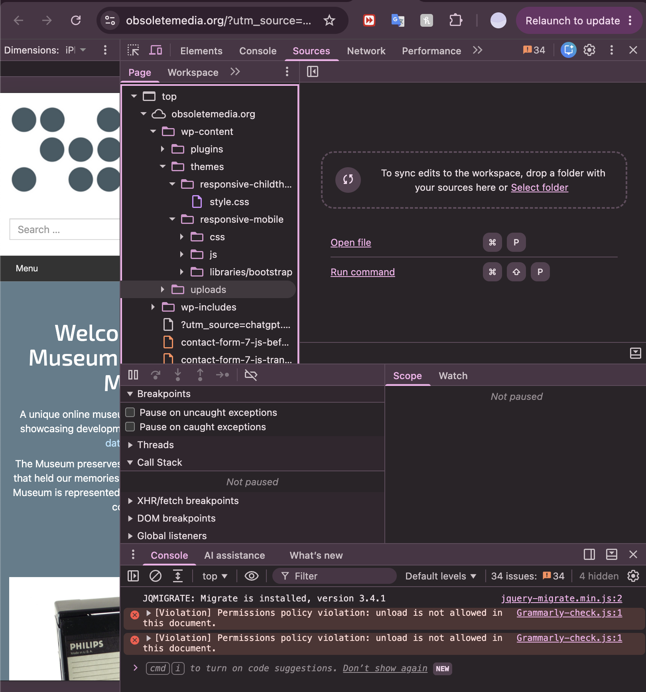

# Source and Style Assignment #1 

## Museum of Obsolete Media

Website: https://obsoletemedia.org/ 

### Web technologies 
After inspecting the website, I found that the website for the Museum of Obsolete Media was build from Wordpress, CSS, HTML and JavaScript. I was able to tell it was built with wordpress because I would the folders "wp-content" and "wp-includes". I also saw the folders style.css, js, and a Bootstrap library. There were also folders of plugins, themes, and uploads which helped me find out what some of the different files and tools were used to actually build the website were.

### Who built the website?
The Museum of Obsolete Media is owned and curated by Jason Curtis. I figured this out by looking at the About section, where there was a section on "Meet the Curator". There he revealed he was both the owner and curator. He is the main person behind the museum but there is and have been other people involved such as donors and sponsors. I figured this out because there was a donors section on the about page where it recognizes people who have donated things, given inspiration, and help with the software used.

 